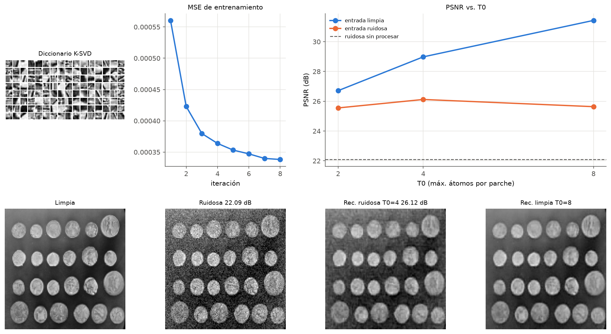
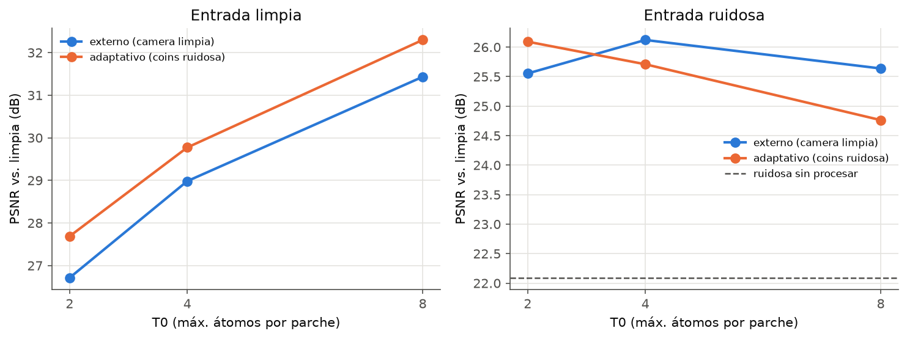

# K-SVD para reconstrucción y eliminación de ruido en imágenes

Adaptación **didáctica y reproducible** de K-SVD (Aharon, Elad y Bruckstein, 2006) y de su uso para
eliminar ruido (Elad y Aharon, 2006). Nuestra propuesta evalúa de manera complementaria las dos
formas de aprendizaje descritas en el artículo de denoising:

1. **Diccionario externo:** 128 átomos aprendidos con 1500 parches 8×8 de `camera` limpia; se
   reconstruye `coins`, que no interviene en el entrenamiento.
2. **Diccionario adaptativo:** 128 átomos aprendidos directamente con los 961 parches de la misma
   observación ruidosa de `coins` que después se reconstruye, sin usar la referencia limpia durante
   el entrenamiento.

Ambas rutas emplean la misma realización de ruido gaussiano (σ = 20/255), T0 = 2, 4 y 8, OMP,
ensamblado y métricas. Así se compara el origen del diccionario bajo un protocolo común.

> No es una réplica de los artículos originales ni pretende superar el estado del arte.

## Resultados ejecutados

| entrada | T0 | MSE | PSNR (dB) | coef. activos |
|---|---:|---:|---:|---:|
| ruidosa sin procesar | — | 0.006179 | 22.09 | — |
| limpia | 2 / 4 / 8 | 0.002132 / 0.001264 / 0.000719 | 26.71 / 28.98 / 31.43 | 2 / 4 / 8 |
| ruidosa | 2 / 4 / 8 | 0.002784 / 0.002442 / 0.002730 | 25.55 / **26.12** / 25.64 | 2 / 4 / 8 |

* Entrenamiento K-SVD (K = 128, 1500 parches, 8 iteraciones, T = 4): 2.09 s en la última ejecución local, **sin
  contingencia**; MSE de entrenamiento 9.55e-4 (`D_init`) → 3.41e-4.
* Imagen ruidosa: mejor T0 = 4, +4.03 dB sobre la entrada. Imagen limpia: el PSNR crece con T0.



La comparación adicional se encuentra en `05_comparacion/comparacion_resultados.csv`:

| diccionario | datos de aprendizaje | mejor T0 ruidoso | MSE | PSNR (dB) |
|---|---|---:|---:|---:|
| externo | `camera` limpia | 4 | 0.002442 | **26.12** |
| adaptativo | `coins` ruidosa | 2 | 0.002459 | **26.09** |

El diccionario adaptativo representó mejor la entrada limpia para los tres T0, pero en denoising su
mejor resultado fue 0.03 dB menor que el externo. Esto no invalida la adaptación: muestra que, con
T0 fijo y sin el término de fidelidad del estimador completo del artículo, aprender de la observación
ruidosa también puede incorporar parte del ruido. La comparación es transductiva y no se presenta
como validación sobre una imagen no vista.



## Estructura

```
├── 00_general/      plan, arquitectura, metodología, reproducción, incidencias
├── 01_datos/        bloque 1 (integrante 1): datos y parches     → datos.npz, config.json
├── 02_modelo/       bloque 2 (integrante 2): OMP + K-SVD         → modelo.npz, historial.csv
├── 03_evaluacion/   bloque 3 (integrante 3): experimentos        → resultados.csv, reconstrucciones.npz
├── 04_final/        bloque 4 (integrante 4): integración, reporte y presentación
├── 05_comparacion/  extensión: diccionario adaptativo, comparación, validaciones y figuras
├── src/             ÚNICA implementación (preprocesamiento, modelo, evaluacion, visualizacion, pipeline)
├── tests/           pruebas unitarias y de integración (pytest)
├── tools/           generación de notebooks, reporte y presentación
├── run_all.py       ejecuta la ruta externa de los cuatro bloques
└── run_comparative.py  ejecuta y compara la ruta adaptativa sin sobrescribir la externa
```

Cada carpeta de bloque contiene su notebook ejecutado, un wrapper `.py` que reexporta desde `src/`,
su nota técnica, sus productos y sus figuras. Guía de revisión por integrante:

| Integrante | Revisar | Documento principal |
|---|---|---|
| 1 | `01_datos/`, `src/preprocesamiento.py`, `tests/test_preprocesamiento.py` | `01_datos/nota_datos.md` |
| 2 | `02_modelo/`, `src/modelo.py`, `tests/test_modelo.py` | `02_modelo/nota_metodo.md` |
| 3 | `03_evaluacion/`, `src/evaluacion.py`, `tests/test_evaluacion.py` | `03_evaluacion/nota_resultados.md` |
| 4 | `04_final/`, `src/pipeline.py`, `tools/`, `tests/test_integracion.py` | `04_final/reporte/reporte.tex` |
| Extensión | `src/adaptativo.py`, `05_comparacion/`, `tests/test_adaptativo.py` | `05_comparacion/README.md` |

## Requisitos clave de implementación
* OMP con `sklearn.linear_model.orthogonal_mp` (no reimplementado).
* SVD con `numpy.linalg.svd` sobre el **residual restringido** a las señales que usan cada átomo.
* Ciclo K-SVD propio (`src/modelo.py::fit_ksvd`); **no** se usa `DictionaryLearning`.
* Las dos variantes reutilizan el mismo núcleo. La adaptativa cambia únicamente el origen de los
  parches de aprendizaje y guarda sus productos por separado.
* La referencia limpia no se entrega al entrenamiento adaptativo; sólo se usa para MSE y PSNR.

## Uso rápido

```bash
python -m venv .venv && source .venv/bin/activate     # o: conda env create -f environment.yml
pip install -r requirements.txt
python run_all.py                  # regenera los productos de los 4 bloques (≈ 10 s)
python run_comparative.py          # entrena la ruta adaptativa y compara ambas propuestas
python run_comparative.py --rebuild-base  # regenera primero la ruta externa
python tools/build_report.py       # compila el reporte si hay un motor LaTeX disponible
python -m pytest                   # pruebas unitarias e integración de ambas rutas
bash tools/execute_notebooks.sh    # regenera y ejecuta los 4 notebooks
```

Kaggle (CPU): ver `00_general/reproduccion.md`. Los notebooks detectan Kaggle y clonan el repositorio.
El [dataset privado v1](https://www.kaggle.com/datasets/sarahvasquez97/ksvd-dani-datos-v1)
y el [notebook privado ejecutado](https://www.kaggle.com/code/sarahvasquez97/01-datos?scriptVersionId=354823890)
corresponden al bloque 1; el pipeline completo se verificó localmente.

## Documentación
* `00_general/metodologia.md` — fundamento, qué se adapta de los artículos y qué se simplifica.
* `00_general/arquitectura.md` — módulos, contrato de archivos, decisiones técnicas.
* `00_general/reproduccion.md` — instrucciones de reproducción desde entorno limpio.
* `00_general/incidencias.md` — problemas encontrados y cómo se resolvieron.
* `04_final/reporte/reporte.tex` / `reporte.pdf` — artículo IEEE de cinco páginas.
* `04_final/presentacion_final.pptx` — presentación editable con notas y responsables.
* `05_comparacion/README.md` — protocolo, resultados y alcance de los dos diccionarios.
* `05_comparacion/adaptativo/config_adaptativa.json` — trazabilidad y diferencias frente al
  estimador completo del artículo.

## Referencias
* M. Aharon, M. Elad, A. Bruckstein, “K-SVD: An Algorithm for Designing Overcomplete Dictionaries
  for Sparse Representation”, IEEE TSP 54(11), 2006. https://doi.org/10.1109/TSP.2006.881199
* M. Elad, M. Aharon, “Image Denoising Via Sparse and Redundant Representations Over Learned
  Dictionaries”, IEEE TIP 15(12), 2006. https://doi.org/10.1109/TIP.2006.881969

Licencia: MIT.
